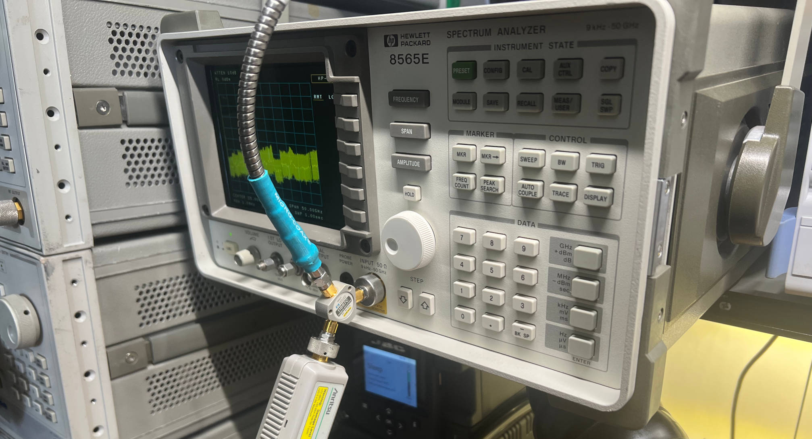
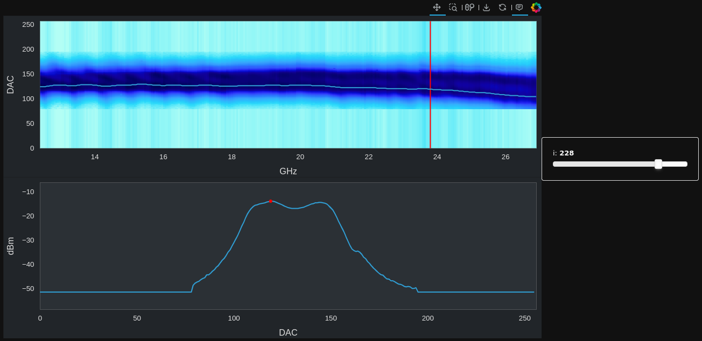
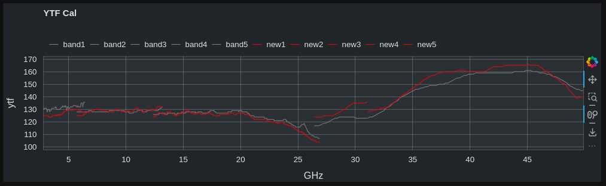
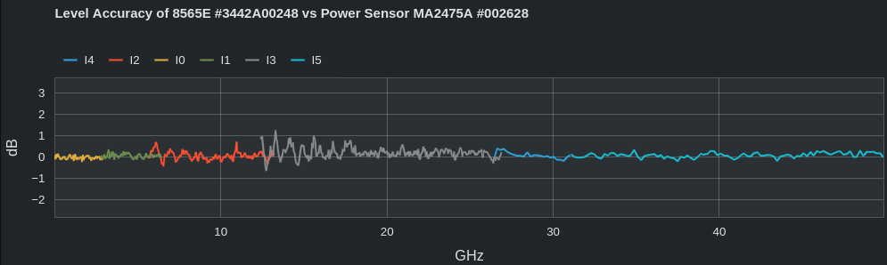

# HP 8560E Calibration

This is some code I wrote to calibrate my 8565E. And my old HP 8562A, and a new 8565E with a price that was too good to pass up... I may have a problem. If you are looking up HP calibration code on github, you may have the same problem. Maybe this will help!

## User Interface

Python notebooks aren't much of a user interface, but for a one-off (or three-off, in this case) job they will do.

**HP8560_calibrate.ipynb:** Runs through a typical calibration process (grab EEPROM, sweep SG/PM, measure SA, run YIG trajectory optimizer, plot validation figures, program new EEPROM settings.)

**HP8560_optimize.ipynb:** When the YIG trajectory optimizer isn't behaving itself, these plots let you dig into the optimization process per-band, tune settings, etc.

**overall.ipynb:** QC for the YIG settings.

## Nuts and Bolts

**HP8560Eeprom.py:** Dumps EEPROM over GPIB.

**HP8560Sweep.py:** Sweeps SG, PM to gather cal info for SA. Puts data into pickle file.

**HP8560SweepResults.py:** Opens pickle file, makes plots, calculates optimal YIG trajectory.
